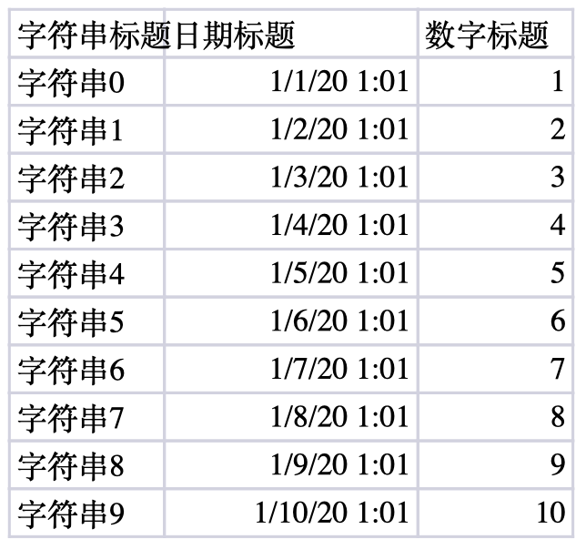

## 介绍

~~~markdown
* EasyExcel是一个基于Java的简单、省内存的读写Excel的开源项目。在尽可能节约内存的情况下支持读写百兆的Excel。

* github地址: https://github.com/alibaba/easyexcel
~~~

## 读取Excel

>https://easyexcel.opensource.alibaba.com/

### 提供excel



### 创建并导入坐标
```xml
<properties>
    <maven.compiler.source>1.8</maven.compiler.source>
    <maven.compiler.target>1.8</maven.compiler.target>
</properties>

<dependencies>
    <dependency>
        <groupId>org.projectlombok</groupId>
        <artifactId>lombok</artifactId>
        <version>1.18.20</version>
    </dependency>
    <dependency>
        <groupId>com.alibaba</groupId>
        <artifactId>easyexcel</artifactId>
        <version>3.1.0</version>
    </dependency>
    <dependency>
        <groupId>com.alibaba</groupId>
        <artifactId>fastjson</artifactId>
        <version>1.2.76</version>
    </dependency>
    <dependency>
        <groupId>junit</groupId>
        <artifactId>junit</artifactId>
        <version>4.12</version>
    </dependency>
    <dependency>
        <groupId>org.slf4j</groupId>
        <artifactId>slf4j-simple</artifactId>
        <version>1.7.30</version>
    </dependency>
</dependencies>
```

### 创建实体

>根据表格的列构建一个对象  

```java
package com.itheima.domain;

import com.alibaba.excel.annotation.ExcelProperty;
import lombok.Data;
import lombok.EqualsAndHashCode;
import lombok.Getter;

import java.util.Date;

@Data
public class DemoData {

    @ExcelProperty("字符串标题")
    private String string;
    @ExcelProperty("日期标题")
    private Date date;
    @ExcelProperty("数字标题")
    private Double doubleData;
}
```
### 创建监听器

>创建一个监听器来实现读取数据  

```java
package com.itheima.listener;

import com.alibaba.excel.context.AnalysisContext;
import com.alibaba.excel.read.listener.ReadListener;
import com.alibaba.excel.util.ListUtils;
import com.alibaba.fastjson.JSON;
import com.itheima.dao.DemoDAO;
import com.itheima.domain.DemoData;
import lombok.extern.slf4j.Slf4j;

import java.util.List;

// 有个很重要的点 DemoDataListener 不能被spring管理，要每次读取excel都要new,然后里面用到spring可以构造方法传进去
@Slf4j
public class DemoDataListener implements ReadListener<DemoData> {

    /**
     * 每隔5条存储数据库，实际使用中可以100条，然后清理list ，方便内存回收
     */
    private static final int BATCH_COUNT = 100;
    /**
     * 缓存的数据
     */
    private List<DemoData> cachedDataList = ListUtils.newArrayListWithExpectedSize(BATCH_COUNT);
    /**
     * 假设这个是一个DAO，当然有业务逻辑这个也可以是一个service。当然如果不用存储这个对象没用。
     */
    private DemoDAO demoDAO;

    public DemoDataListener() {
        // 这里是demo，所以随便new一个。实际使用如果到了spring,请使用下面的有参构造函数
        demoDAO = new DemoDAO();
    }

    /**
     * 如果使用了spring,请使用这个构造方法。每次创建Listener的时候需要把spring管理的类传进来
     *
     * @param demoDAO
     */
    public DemoDataListener(DemoDAO demoDAO) {
        this.demoDAO = demoDAO;
    }

    /**
     * 这个每一条数据解析都会来调用
     *
     * @param data    one row value. Is is same as {@link AnalysisContext#readRowHolder()}
     * @param context
     */
    @Override
    public void invoke(DemoData data, AnalysisContext context) {
        log.info("解析到一条数据:{}", JSON.toJSONString(data));
        //读取到一条记录添加到集合
        cachedDataList.add(data);
        // 达到BATCH_COUNT了，需要去存储一次数据库，防止数据几万条数据在内存，容易OOM
        if (cachedDataList.size() >= BATCH_COUNT) {
            saveData();
            // 存储完成清理 list
            cachedDataList = ListUtils.newArrayListWithExpectedSize(BATCH_COUNT);
        }
    }

    /**
     * 所有数据解析完成了 都会来调用
     *
     * @param context
     */
    @Override
    public void doAfterAllAnalysed(AnalysisContext context) {
        // 这里也要保存数据，确保最后遗留的数据也存储到数据库
        saveData();
        log.info("所有数据解析完成！");
    }

    /**
     * 加上存储数据库
     */
    private void saveData() {
        log.info("{}条数据，开始存储数据库！", cachedDataList.size());
        demoDAO.save(cachedDataList);
        log.info("存储数据库成功！");
    }
}
```

### 创建持久层

> 解析的excel数据需要保存到数据库，就需要创建DemoDAO

```java
package com.itheima.dao;

import com.itheima.domain.DemoData;

import java.util.List;

/**
假设这个是你的DAO存储。当然还要这个类让spring管理，当然你不用需要存储，也不需要这个类。
 **/
public class DemoDAO {
    public void save(List<DemoData> list) {
        // 如果是mybatis,尽量别直接调用多次insert,自己写一个mapper里面新增一个方法batchInsert,所有数据一次性插入
    }
}
```

### 测试文件读取  

~~~java
package com.itheima.test;

import com.alibaba.excel.EasyExcel;
import com.alibaba.excel.read.listener.PageReadListener;
import com.itheima.domain.DemoData;
import com.itheima.listener.DemoDataListener;
import lombok.extern.slf4j.Slf4j;
import org.junit.Test;

@Slf4j
public class ReadExcelTest {

    //方式一: 直接读取
    @Test
    public void test1() {
        String fileName = "C:\\Users\\ys\\Desktop\\huike\\excel读取测试.xlsx";

        // 这里 需要指定读用哪个class去读，然后读取第一个sheet文件流会自动关闭
        EasyExcel.read(fileName, DemoData.class, new PageReadListener<DemoData>(dataList -> {
            for (DemoData data : dataList) {
                System.out.println("读取到一条数据:" + data);
            }
        })).sheet().doRead();
    }

    //方式二: 缓冲读取
    @Test
    public void test2() {
        String fileName = "C:\\Users\\ys\\Desktop\\huike\\excel读取测试.xlsx";

        // 这里 需要指定读用哪个class去读，然后读取第一个sheet文件流会自动关闭
        EasyExcel.read(fileName, DemoData.class, new DemoDataListener()).sheet().doRead();
    }
}
~~~


## 输出Excel

### 输出的execl

| 姓名 | 年龄 | 创建时间            |
| ---- | ---- | ------------------- |
| 张三 | 20   | 2021-05-05 07:05:55 |
| 李四 | 15   | 2019-10-05 10:17:42 |
| 王五 | 22   | 2022-11-15 16:20:23 |

### 创建对象


```java
package com.itheima.domain;

import com.alibaba.excel.annotation.ExcelIgnore;
import com.alibaba.excel.annotation.ExcelProperty;
import lombok.Data;

import java.util.Date;

@Data
public class User {
    @ExcelProperty("姓名")
    private String name;

    @ExcelProperty("年龄")
    private Integer age;

    @ExcelProperty("创建时间")
    private Date createTime;

    @ExcelIgnore//忽略这个字段
    private String ignore;
}
```

### 输出测试 

```java
package com.itheima.test;

import com.alibaba.excel.EasyExcel;
import com.alibaba.excel.ExcelWriter;
import com.alibaba.excel.util.ListUtils;
import com.alibaba.excel.write.metadata.WriteSheet;
import com.itheima.domain.ExcelData;
import com.itheima.domain.User;
import org.junit.Test;

import java.util.Date;
import java.util.List;

public class WriteExcelTest {

    private static List<User> list = ListUtils.newArrayList();

    //准备输出的数据
    static{
        for (int i = 0; i < 10; i++) {
            User data = new User();
            data.setName("字符串" + i);
            data.setAge(10 + i);
            data.setCreateTime(new Date());
            list.add(data);
        }
    }

    @Test
    public void test1() {
        String fileName = "D:/upload/excel输出测试.xlsx";
        EasyExcel.write(fileName, User.class).sheet("模板").doWrite(list);
    }

    @Test
    public void simpleWrite2() {
        String fileName = "D:/upload/excel输出测试.xlsx";
        // 这里 需要指定写用哪个class去写
        ExcelWriter excelWriter = null;
        try {
            excelWriter = EasyExcel.write(fileName, ExcelData.class).build();
            WriteSheet writeSheet = EasyExcel.writerSheet("模板").build();
            excelWriter.write(list, writeSheet);
        } finally {
            // 千万别忘记finish 会帮忙关闭流
            if (excelWriter != null) {
                excelWriter.finish();
            }
        }
    }
}
```

## 常见API

> https://easyexcel.opensource.alibaba.com/docs/current/api/